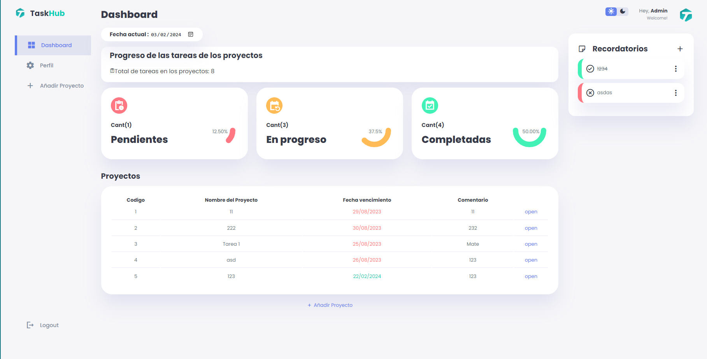
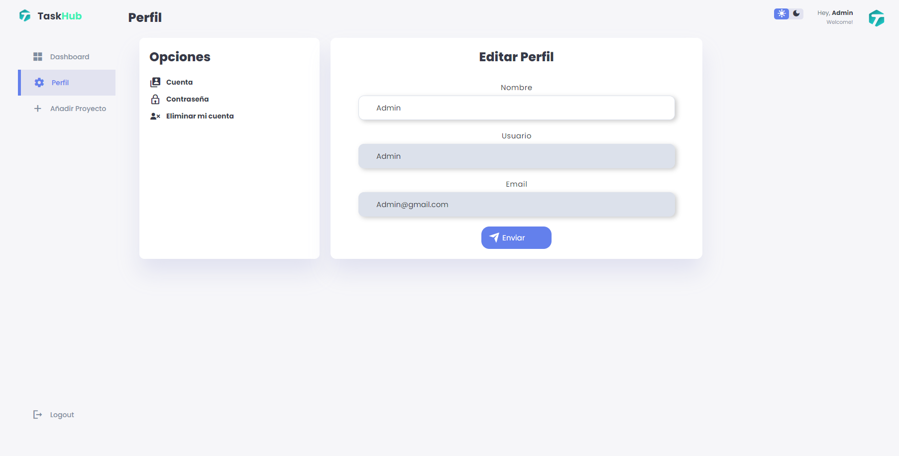
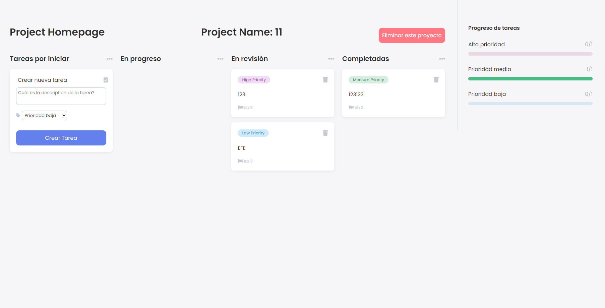

# Guía para el Proyecto de TaskHub
Esta guía proporciona instrucciones detalladas sobre cómo se creo y terminos del proyecto de gestión de tareas y proyectos.

#### Explicación de las dependencias del back-end:
- **Node.js**: Un entorno de ejecución de JavaScript del lado del servidor que permite ejecutar código JavaScript fuera del navegador web. Es especialmente adecuado para la creación de aplicaciones web escalables y de alto rendimiento.
- **jQuery**: Una biblioteca de JavaScript rápida, pequeña y rica en características que simplifica la manipulación del DOM, el manejo de eventos, las animaciones y las interacciones AJAX en las aplicaciones web.
- **Express.js**: Un marco de aplicación web rápido, minimalista y flexible para Node.js. Es muy utilizado para crear APIs RESTful y aplicaciones web.
- **Express-session**: Un middleware para Express.js que facilita el manejo de sesiones en las aplicaciones web. Permite almacenar datos de sesión en el servidor y asociarlos con un identificador único en la cookie del navegador del usuario.
- **Nodemon**: Una utilidad que monitoriza los cambios en los archivos de tu aplicación y automáticamente reinicia el servidor. Es muy útil durante el desarrollo para evitar tener que reiniciar manualmente el servidor después de cada cambio.

#### Explicación de las herramientas del front-end:
- **HTML**: Es el lenguaje de marcado estándar utilizado para crear y diseñar páginas web. Se utiliza para estructurar el contenido de una página web mediante etiquetas que definen diversos elementos como encabezados, párrafos, enlaces, imágenes, formularios, entre otros.
- **CSS**: Es un lenguaje de hojas de estilo utilizado para definir el aspecto y el formato visual de una página web. Permite controlar la presentación de los elementos HTML, como el color, la tipografía, el diseño, el espaciado, entre otros, de manera separada del contenido HTML.
- **Sass**: Es una extensión de CSS que añade características y funcionalidades adicionales al lenguaje, como variables, anidamiento de selectores, mixins, funciones, entre otros. Sass ayuda a escribir estilos CSS de manera más eficiente y mantenible, permitiendo una mejor organización y reutilización del código. Luego, se compila en CSS estándar para ser utilizado en el desarrollo web.

## Pasos para ejecutar el Proyecto
### En consola ejecutar el archivo server.js que crear el servidor en el puerto "443".
Desde la raíz del proyecto, ejecutar los siguientes comandos para iniciar el servidor y el cliente:
```bash
cd Server
node server.js
```

### Ejemplos de páginas del proyecto:

A continuación se muestran algunas capturas de pantalla de las páginas principales del proyecto:

- **Dashboard**: Página principal del usuario que muestra un resumen de actividades.
  

- **Página de inicio de sesión**: Interfaz de inicio de sesión para los usuarios.
  

- **Página de registro**: Formulario de registro para nuevos usuarios.
    

- **Página de perfil**: Vista del perfil del usuario con información personal.
  

- **Página de proyectos**: Lista de las tareas disponibles para el usuario dentro de un proyecto específico.
  
